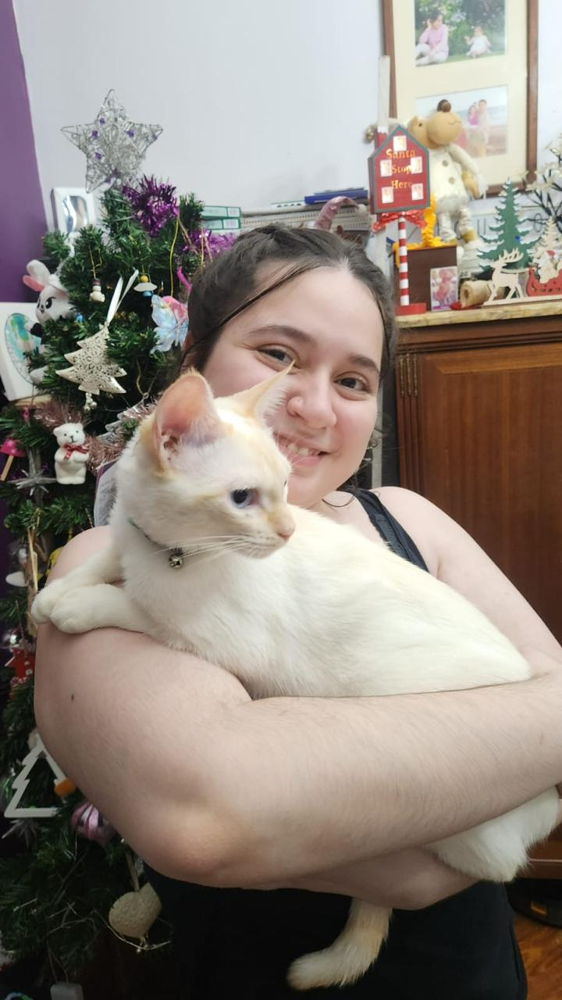
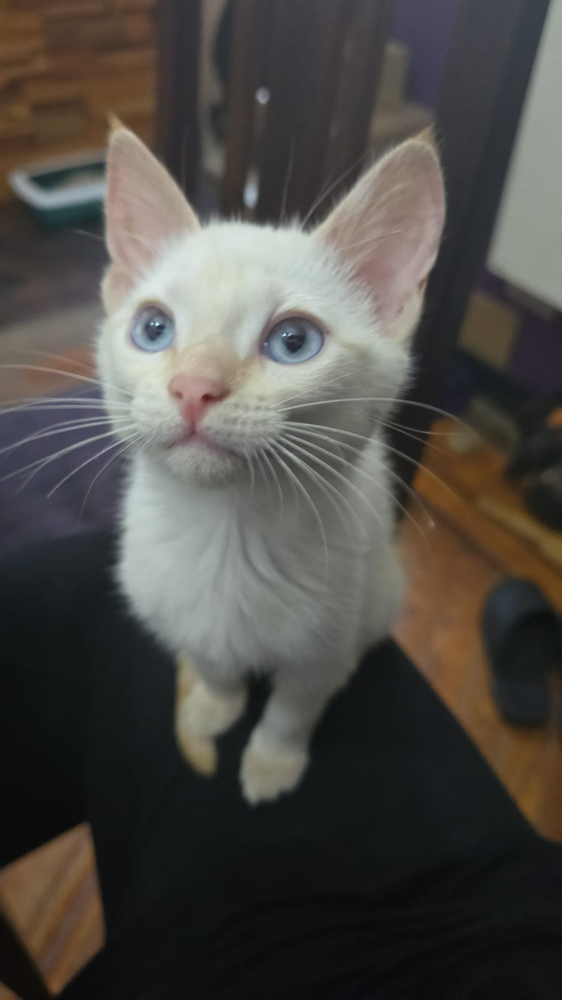
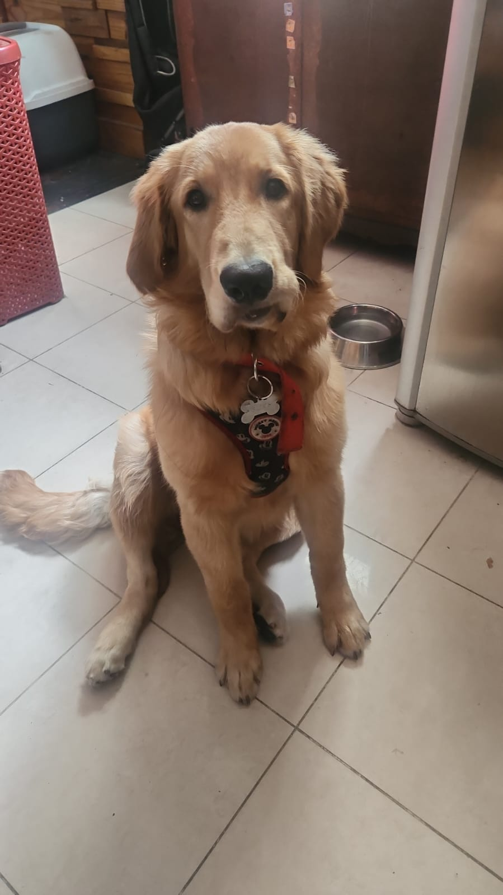

# Presentación: María Victoria Poggio

## Legajo: 214-014.7

---

Soy Vicky, y estoy en el 3er año desde que empecé la carrera. Me gusta mucho escuchar música, mayormente en inglés, y ultimamente estoy escuchando mucho *EPIC: The Musical*, especialmente mientras cocino, cosa que también disfruto. Puedo cocinar de todo, pero me llevo mejor con lo dulce. Aparte de eso, jugar con la PC es algo que también hago en mi tiempo libre; algunos de mis favoritos son Hollow Knight, Slay The Spire, Avatar: Frontiers of Pandora, Hades y No Man's Sky.

Tengo dos mascotas: una gata llamada Aerin y una Golden Retriever llamada Suki. Los nombres fueron elegidos por mi familia, especéficamente por mi hermana menor, a quien le gustan las bandas K-pop, y por mi mamá, que también le gustan las bandas, y las series coreanas.

